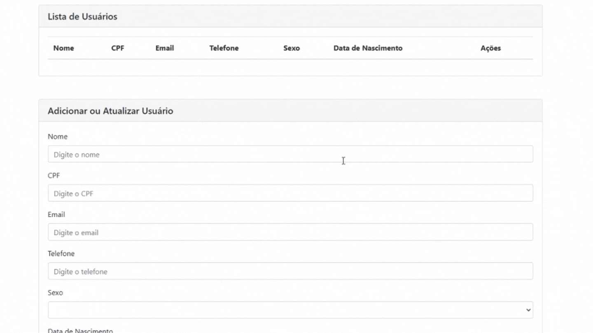

<h2 align="center">💡 Teste BRQ - Letícia Araujo</h2>

<hr/>




## ⚙️ Tecnologias utilizadas:

- ASP Net Core 3
- Angular
- Bootstrap
- C#
- SQL Server
- Cors;
- Swagger

## ⛏ Ferramentas:

- SQL Server
- VsCode
- Docker
- Azure Data Studio

## 🏁 Como rodar o Projeto:

Clone o repositório:

```bash
$ git clone https://github.com/araujooleticiaa/testebrq-leticiaaraujo
```

cd `backend` e rode:

```bash
dotnet restore
```
Para iniciar o servidor:

```bash
dotnet watch run
```
<br/>

cd `frontend` e rode:

```bash
npm install
```

Para iniciar o frontend:

```bash
ng serve -o
```


<h4 align="center">
  ---

Made with ♥ by Letícia Araújo :wave: [Get in touch!](https://www.linkedin.com/in/leticiaa-araujoo/)
</h4>
<br/>


